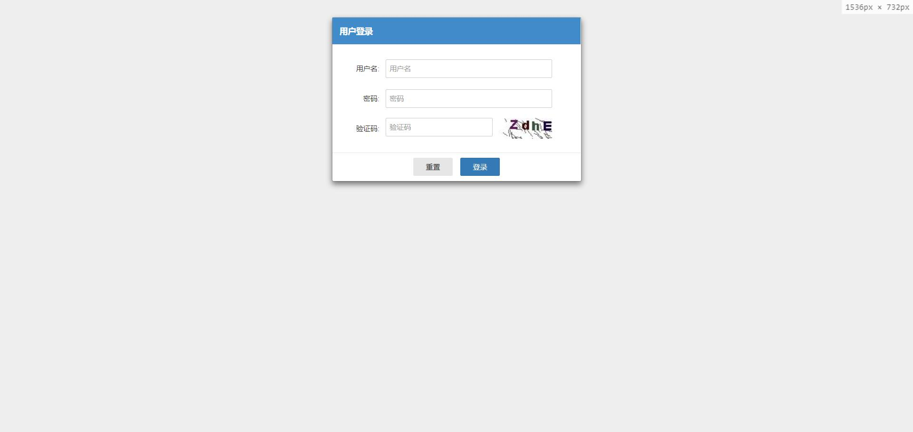
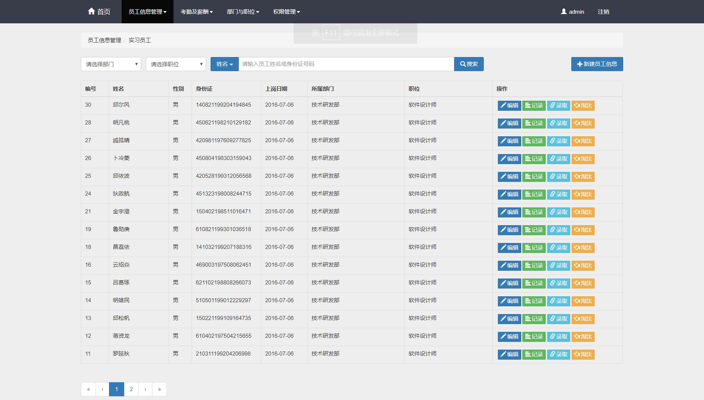
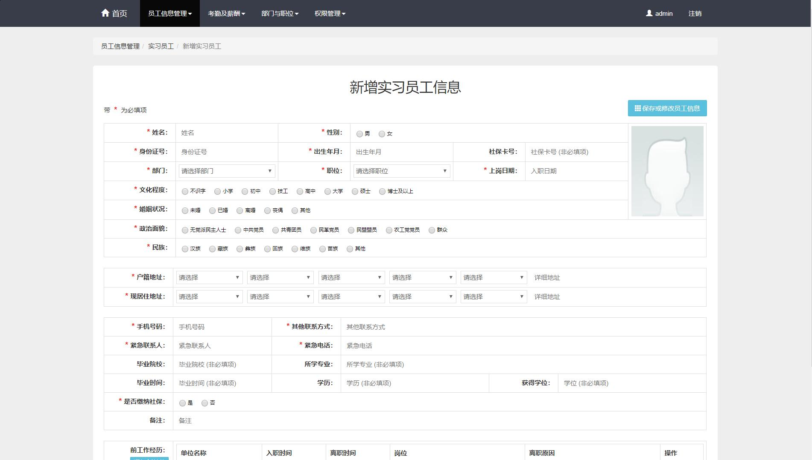
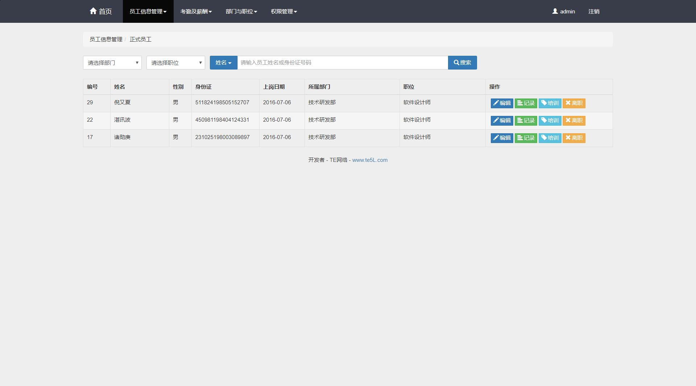
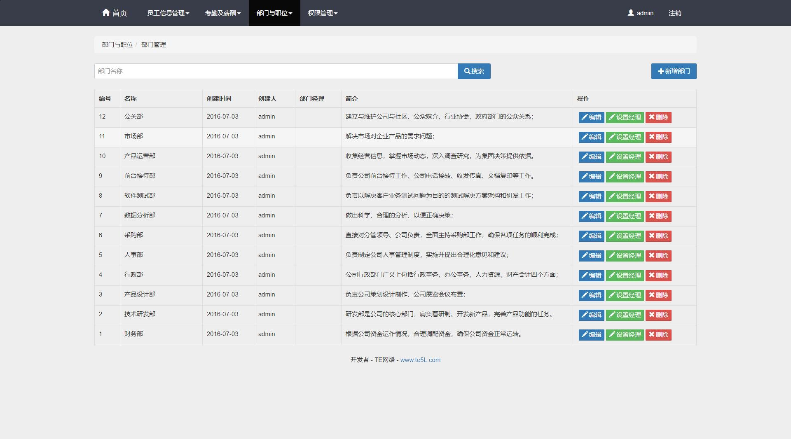
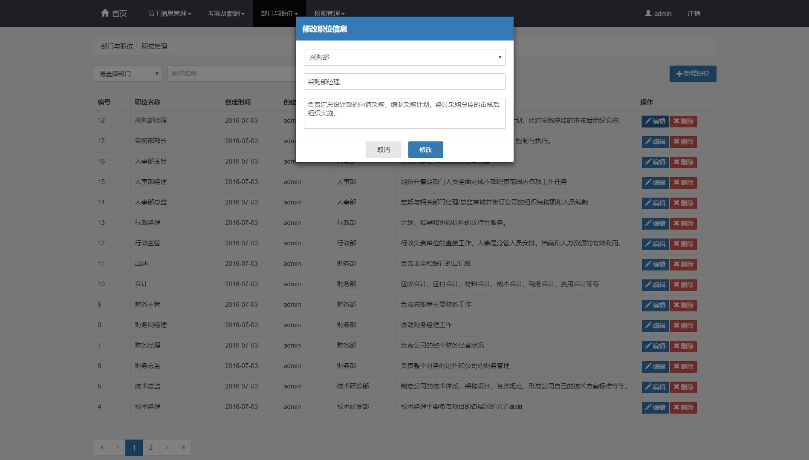
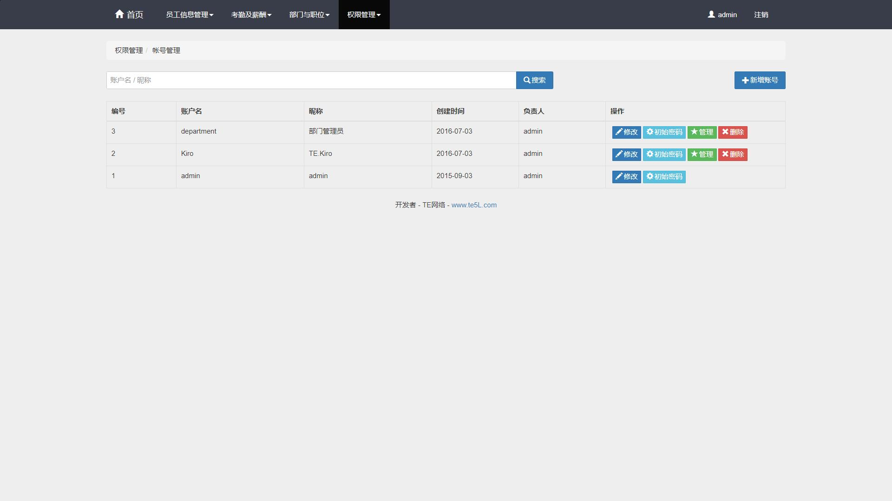
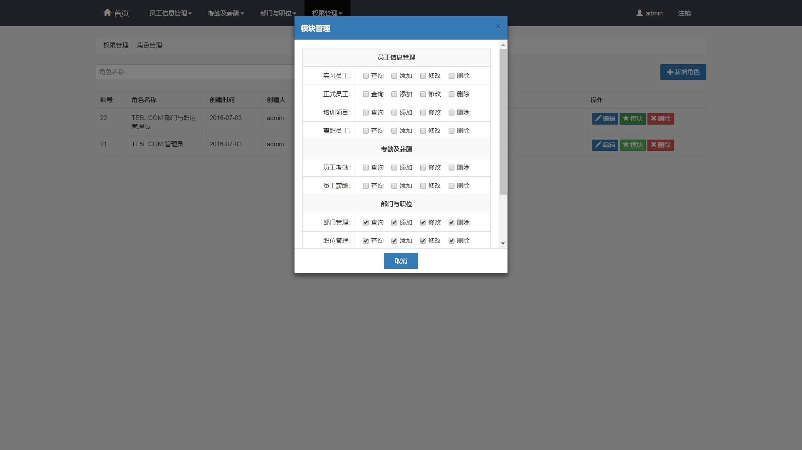
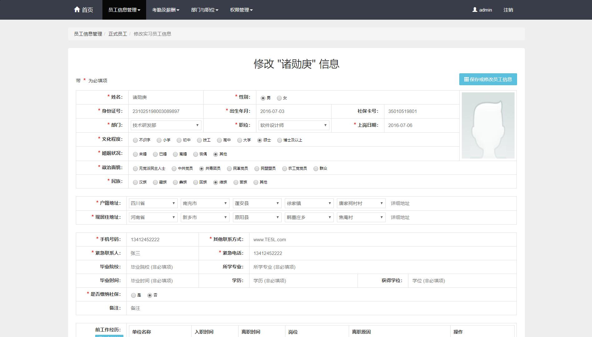
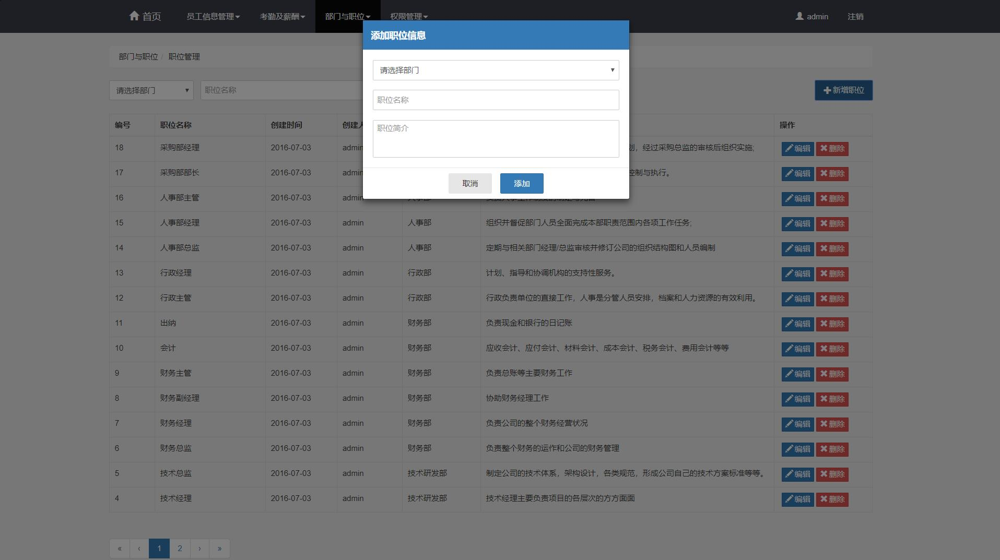

<h1 align="center">公司人员信息管理系统</h1>

## 简介
公司人员信息管理系统：提供员工信息管理、考勤分类、部门职位管理、权限管理等功能，支持信息录入、编辑、查询、导入导出，提高人事管理效率及准确性。    --计算机毕业设计源码；毕设源码；java毕业设计源码

## 联系方式

<h3 align="center">获取完整代码与数据库文件 + 微信：bysj5151 QQ: 86050149 QQ群: 783742310</h3>

<h3 align="center">可帮忙远程部署 包运行成功！提供远程部署、修改代码、设计文档指导、代码讲解等服务！</h3>

## 功能介绍（完整见运行截图）
管理员：基本功能包括登录、注册和退出。可以在用户管理模块中添加、编辑、删除和查询员工信息。权限管理模块允许管理员编辑账号、重置密码和分配权限。部门与职位管理模块支持查看、添加、编辑和删除部门及职位。系统允许管理员进行数据导入、导出和批量处理，加强信息管理的效率。  
用户：基本功能包括登录、注册和退出。用户可以查看个人信息，也可通过不同的模块查看和更新职位、部门和权限等相关信息。用户还能够使用系统的搜索和过滤功能快速查找所需信息，并有权限导出自己的相关数据。

## 运行截图

本代码来源于网络,仅供学习参考使用!

